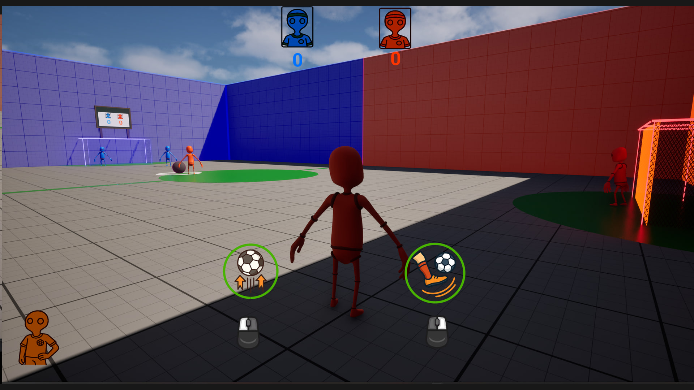
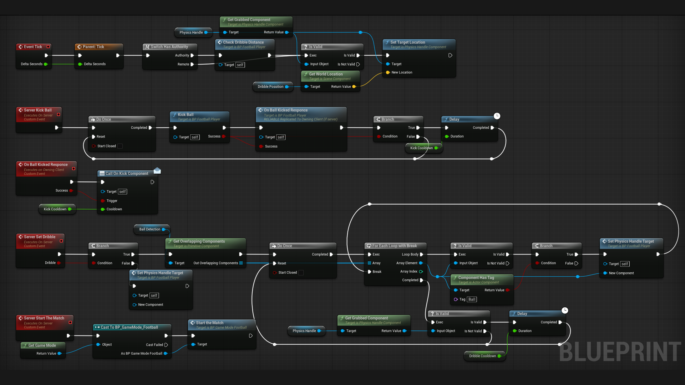
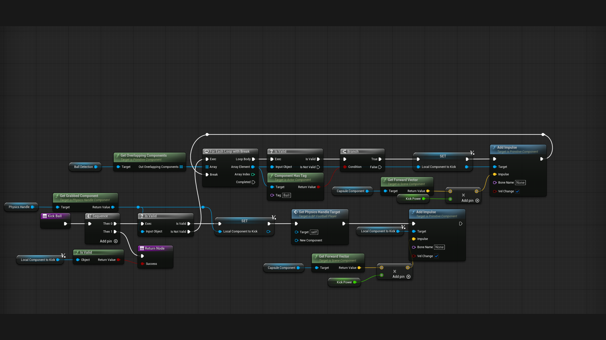
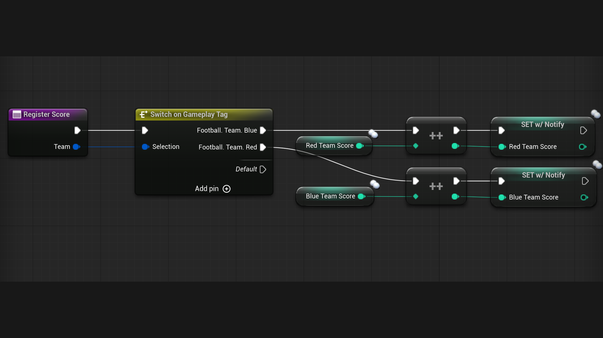
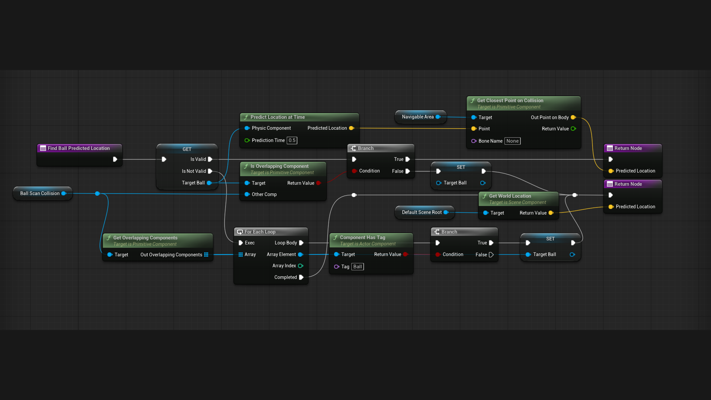

# Multiplayer Football

**Unreal Engine 5.7 multiplayer gameplay showcase**  
**Developer:** Dmytro Kalinnikov

A competitive 1v1 football prototype focused on server-authoritative gameplay, responsive physics interactions, and reliable network replication.

## Gameplay demo

**[▶ Watch the 47-second two-client multiplayer demo](Docs/Videos/readme/Showcase_Dmytro_Preview.mp4)**

The two-client capture shows both host and remote-client goals, server-authoritative scoring, replicated match state, synchronized HUD updates, celebrations, and round resets.

## Highlights

- Replicated shooting and ball possession with server-side validation.
- Complete match loop: lobby, team assignment, scoring, celebration, and round reset.
- Physics Handle-based ball control and object pooling.
- Event-driven HUD and scoreboard updates without Tick-based polling.
- Predictive goalkeeper AI with configurable reaction time.
- Hybrid C++ and Blueprint architecture.

## Tech stack

`Unreal Engine 5.7` | `C++` | `Blueprints` | `RPCs` | `RepNotify` | `UMG` | `Enhanced Input` | `Physics Handle`

## Controls

| Input | Action |
| --- | --- |
| Left mouse button | Shoot |
| Hold right mouse button | Possess the ball |
| Release right mouse button | Release the ball |

## Selected implementation

Click any image to open the full-resolution graph.

### Replicated player abilities

Server RPCs validate shooting and dribbling requests. Ball possession uses a Physics Handle, while the kick function selects a valid nearby ball component and applies the configured impulse.

### Match state and scoreboard

Gameplay Tags route each goal to the correct team score. RepNotify publishes the updated value to connected clients and presentation systems.

### Predictive goalkeeper AI

The goalkeeper finds the active ball, predicts its future position from velocity, and constrains the target point to its navigable area.

## Run locally

1. Install Unreal Engine 5.7.
2. Open `Showcase_Dmytro.uproject`.
3. Allow Unreal Engine to rebuild the C++ module if prompted.
4. For a multiplayer test, run at least two players in **Play As Listen Server** mode.

The default map is `Content/Showcase/FootballField`.
